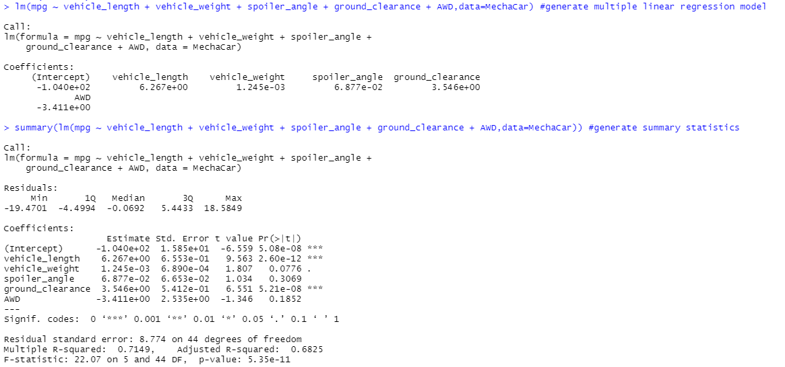
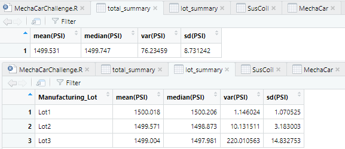
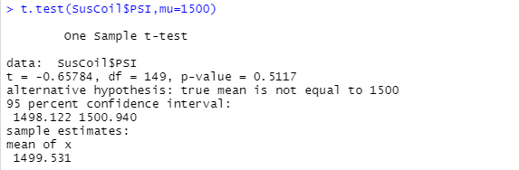
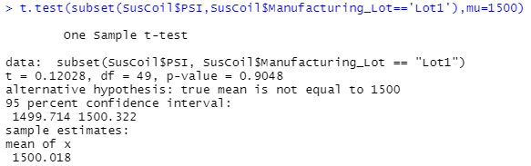
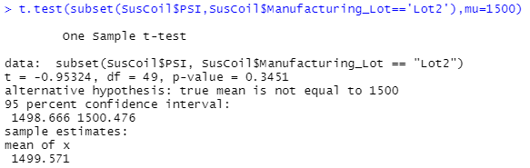
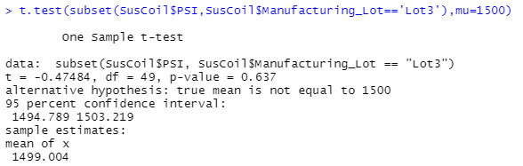

# Statistical Analysis on AutoRUs' latest prototype, MechaCar
The data analysis team at AutoRUs is responsible for performing retrospective analysis of histrorical data, analytical verification and validation of current
automotive specifications and the study design of future product testing.  
AutoRUs'newest prototype, the MechaCar, is suffering from production troubles that are blocking the manufacturing team's progress. So we are reviewing the production data for insights that may help the manufacturing team.

In this analysis we are: 
- Performing multiple linear regression analysis to identify which variables in the dataset predict the mpg of MechaCar prototypes.
- Collecting summary statistics on the pounds per square inch (PSI) of the suspension coils from the manufacturing lots.
- Running t-tests to determine if the manufacturing lots are statistically different from the mean population.
- Design a statistical study to compare vehicle performance of the MechaCar vehicles against vehicles from other manufacturers. For each statistical analysis, you’ll write a summary interpretation of the findings.

The data used for the analysis: 
[MecharCar_mpg.csv](MechaCar_mpg.csv) 
[Suspension_Coil.csv](Suspension_Coil.csv)

## Linear Regression to Predict MPG

- ***Which variables/coefficients provided a non-random amount of variance to the mpg values in the dataset?***
  
    According to our results, vehicle length and ground clearance (as well as intercept) are statistically unlikely to provide random amounts of variance to the linear model. In other words the vehicle length and ground clearance have a significant impact on MPG.

    The Intercept is also significant at 0.001, which means there are factors not available in the dataset that contribute to the MPG value.

- ***Is the slope of the linear model considered to be zero? Why or why not?***

    The slope of the linear model is not considered to be zero because there is significant relationship between 2 independent variables (vehicle length and ground clearance) and the dependent variable (mpg).
  
- ***Does this linear model predict mpg of MechaCar prototypes effectively? Why or why not?***

    The Multiple R-squared value is 0.7149. Hence, the model predicts MPG of MechaCar effectively at a 71% rate. But as mentioned above there could be more factors not included in this dataset that can be used to make a better prediction.

 
 

## Summary Statistics on Suspension Coils

The design specifications for the MechaCar suspension coils dictate that the variance of the suspension coils must not exceed 100 pounds per square inch. 

***Does the current manufacturing data meet this design specification for all manufacturing lots in total and each lot individually? Why or why not?***

To answer the above question statistical values on Suspension Coils for all the lots and individual lots are calculated and results are in the figure below:

Based on the results, the manufacturing lots when grouped together meet the design specification as the variance on PSI is 76. 

Individually, lot 1 and lot 2 are meeting the design specifications as they have the variance on PSI as 1 and 10 respectively. However, with variance on PSI as 220, lot 3 does not meet the design specification.
 
 

## T-Tests on Suspension Coils
We performed t-tests to determine if all manufacturing lots and each lot individually are statistically different from the population mean of 1,500 pounds per square inch.

NULL Hypothesis: There is no significant difference between the mean PSI of all manufacturing lots and individual lots and population mean of 1500 PSI.

Alternate Hypothesis: There is significant difference between the mean PSI of all manufacturing lots and population mean of 1500 PSI

The significance value we are considering is 0.05.

The t test result on all the lots is as follows. Since the p-value is 0.5, more than our significance value of 0.05, we FAIL to reject the NULL hypothesis for all manufacturing lots grouped together.

The t test results of individual lots show the following p-values:  
Lot 1 - 0.9  
Lot 2 - 0.3  
Lot 3 - 0.6  
Since the p-values of all the 3 lots t-test is more than 0.05, we FAIL to reject the NULL hypothesis for individual lots too.

Lot 1 t test results:

Lot 2 t test results:

Lot 3 t test results:

 
 

## Study Design: MechaCar vs Competition

At MechaCar we are performing statistical study that can quantify how the MechaCar performs against the competition. In our study design, we are thinking of metrics that would interest consumers and motivate them to buy MechaCar vehicles based on data.

### Description:
In order to test MechaCar against competition, we  would like to perform statistical analysis on following metrics: 
1. Horsepower
2. Fuel Efficiency and
3. Price

The vehicle class for our comparison is Sedan. 
 

Our study hypothesis are defined as:

H0: There is NO statistical significant difference on defined metrics between MechaCar and competition.
  

Ha: The *is* statistical significant difference on defined metrics between MecharCar and competition.

The significance value defined for our study is **0.05**.

In order to perform the analysis, we are collecting *Horsepower, Fuel Efficiency and Price* data for all MechaCar competitors from Sedan vehicle class. All the competitor data is grouped together for our analysis.
  
Then we would perform t-tests on each metrics for MechaCar against the same metric from the collective competition data.

If the p-value for each t-tests is less than 0.05 then we will reject our NULL hypothesis.
